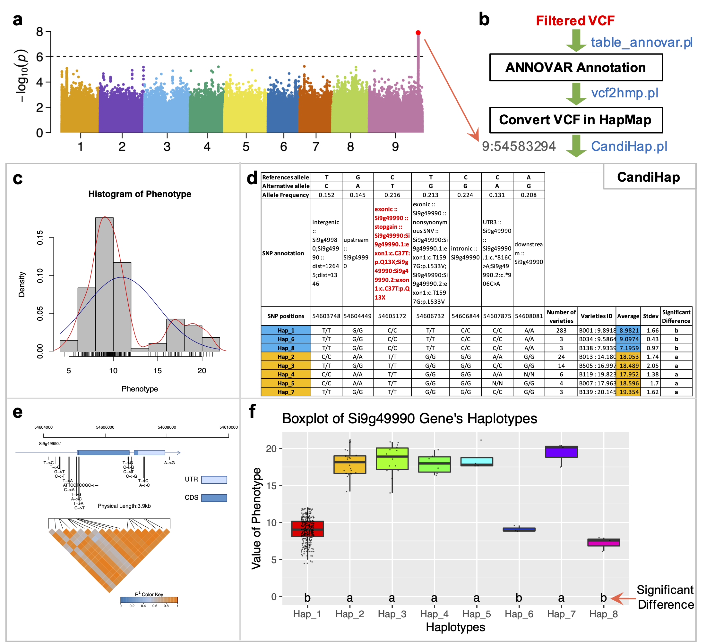

## CandiHap: a haplotype analysis toolkit for natural variation study.

 

__`CandiHap`__ is a user-friendly local software, that can fast preselect candidate causal SNPs from __`Sanger or next-generation sequencing data`__, and report results in table and exquisite vector-graphs within a minute. Investigators can use CandiHap to specify a gene or linkage sites based on GWAS and explore favourable haplotypes of candidate genes for target traits. CandiHap can be run on computers with __`Windows`__, __`Mac OS X`__, or __`Linux`__ platforms in graphical user interface or command lines, and applied to __`any species`__ of plant, animal and microbial. CandiHap is publicly available at https://github.com/xukaili/CandiHap or https://bigd.big.ac.cn/biocode/tools/BT007080 as an open-source software. The analysis of CandiHap can do as the followings:   
    **1).** Convert the VCF file to the hapmap format for CandiHap (__`vcf2hmp`__); 
    **2).** Haplotype analysis for a gene (__`CandiHap`__); 
    **3).** Haplotype analysis for all genes in the LD regions of a significant SNP one by one (__`GWAS_LD2haplotypes`__); 
    **4).** Haplotype analysis for Sanger sequencing data of population variation (__`sanger_CandiHap.sh`__).  
And a new __`CandiHap`__ V2 R package is publicly available at https://github.com/guokai8/CandiHap ！ 

## Download:
**Download All Files**:      [GitHub](https://github.com/xukaili/CandiHap/archive/master.zip)                [Google Drive](https://drive.google.com/drive/folders/1rkm__0jlPrWvs8Cy_T46d3sKBf6UIVhQ?usp=sharing)                [Baidu Pan](https://pan.baidu.com/s/1migiq6x5v5CgYlBntY8aYw):   access_code: **4d4q**  

## License
__`Academic users`__ may download and use the application free of charge according to the accompanying license. 
__`Commercial users`__ must obtain a commercial license from Xukai Li. 
**If you have used the program to obtain results, please cite the following paper:** 
> Xukai Li☯* (李旭凯), Zhiyong Shi☯ (石志勇), Qianru Qie (郄倩茹), Jianhua Gao (高建华), Yiwei Jiang (姜亦巍), Yuanhuai Han (韩渊怀) & Xingchun Wang* (王兴春). CandiHap: a haplotype analysis toolkit for natural variation study. bioRxiv 2020.02.27.967539. doi: https://doi.org/10.1101/2020.02.27.967539 
> （☯ Equal contributors; * Correspondence） 
 

## Dependencies
__`perl 5`__, __`R ≥ 3.2`__ (with ggplot2, agricolae, pegas and sangerseqR), and __`electron`__.   

## Figures

**Fig. 1 | Overview of the CandiHap process.** __`a,`__ A GWAS result. __`b,`__ General scheme of the process. __`c,`__ The histogram of phenotype. __`d,`__ The statistics of haplotypes and significant differences haplotypes are highlighted by color boxes. __`e,`__ Gene structure and SNPs of a critical gene. __`f,`__ Boxplot of a critical gene’s haplotypes.  

**Fig. 2 | Haplotype analysis of the *ARE1* gene in rice compared with the results by [Wang *et al*. 2018, *Nat*. *Commun*. 9, 735](https://www.nature.com/articles/s41467-017-02781-w/figures/5)**. __`a,`__ Gene structure and SNPs of *ARE1*. __`b,`__ Major haplotypes of SNPs in the *ARE1* coding region of 2747 rice varieties. __`c,`__ The haplotype results of *ARE1* coding region of 3023 rice varieties using CandiHap (SNPs data were downloaded from [RFGB](http://www.rmbreeding.cn)). Major SNP haplotypes and casual variations in the encoded amino acid residues are shown. The five more SNPs is due to the fact that there are 276 more rice varieties used in our study (highlighted by blue boxes), and **two errors highlighted by red boxes**.   

## Contact information
In the future, **CandiHap** will be regularly updated, and extended to fulfill more functions with more user-friendly options. 
For any questions please contact xukai_li@sxau.edu.cn or xukai_li@qq.com  
